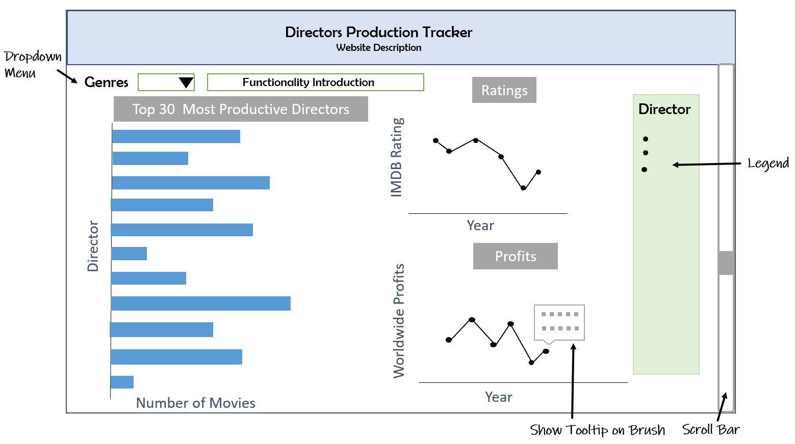

# DSCI532_GROUP104_Movies

### Visualization App Purpose
Our proposed project is a data visualization app. Investors and researchers can select a movie genre to find out the top 30 most experienced directors of that genre, and then review and compare individual director's statistics by filtering. The full proposal can be found in [our proposal file](https://github.com/UBC-MDS/DSCI532_GROUP104_Movies/blob/master/proposal.md).

### App Description 
The landing page of the app contains a bar chart of the top 30 most productive directors, and two line plots showing the ratings and profits of movies of these 30 directors across the years. With the genre dropdown menu, users can define the genre (i.e. Drama) to visualize the top 30 most productive directors in the bar chart. Users can click on the bar representing the director in the bar chart to explore and get the corresponding line charts showing ratings and profits related to the movies of the selected director. Besides users can choose multiple directors and compare movie ratings and profits from different directors by clicking on multiple bars. You can find the deployed app here: [Directors Production Tracker](https://directors-production-track-app.herokuapp.com).

### APP Functionality
Users can first choose a genre to explore in the `Genres` dropdown menu. Then users get a bar chart showing the number of movies from the top 30 most productive directors in that genre. Now users can click on a director's bar to see his statistics (ratings and profits of his movies). To compare different directors, users can choose multiple directors by `shift + click` on corresponding bars. In the `Ratings` and `Profits` plots, each data point represents a single movie and points from the same director are linked by lines. If users hover the pointer over a data point, without clicking, a tooltip will appear to show the represented movie's title, director, genre, and ratings or profits.

### App Sketch  

### Contribution
We welcome all feedback and contributions. If you are interested in contributing to our app, please read our [contributing document](https://github.com/UBC-MDS/DSCI532_GROUP104_Movies/blob/master/CONTRIBUTING.md) and our [code of conduct](https://github.com/UBC-MDS/DSCI532_GROUP104_Movies/blob/master/CODE_OF_CONDUCT.md). Our [license](https://github.com/UBC-MDS/DSCI532_GROUP104_Movies/blob/master/LICENSE) outlines our permissions and copyright information for users.

### Creators
This GitHub repository was created by Sarah Weber, Fanli Zhou, and Wenjiao Zou. 
